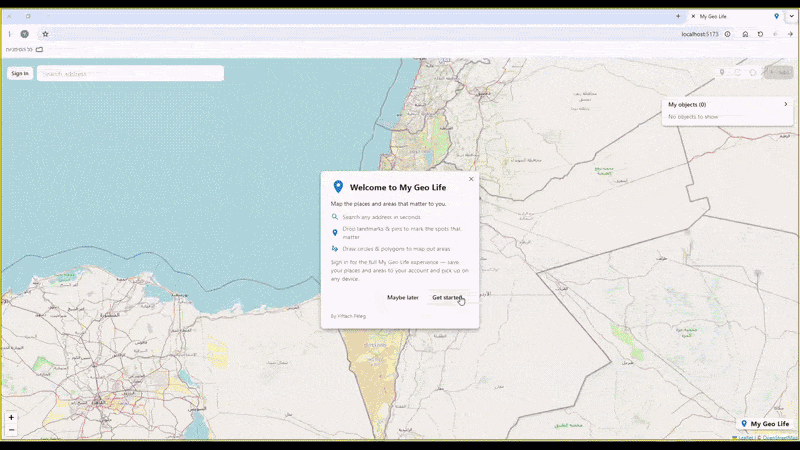
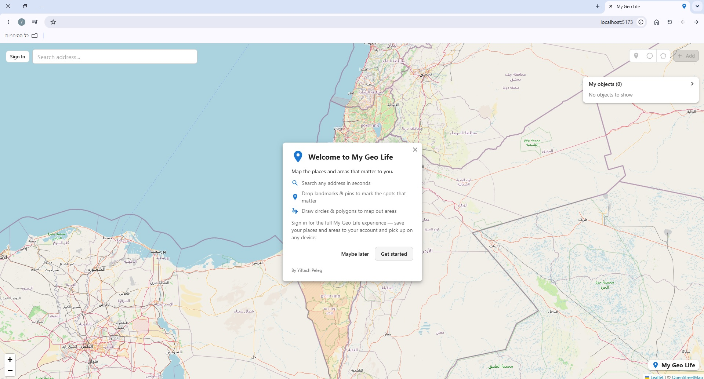
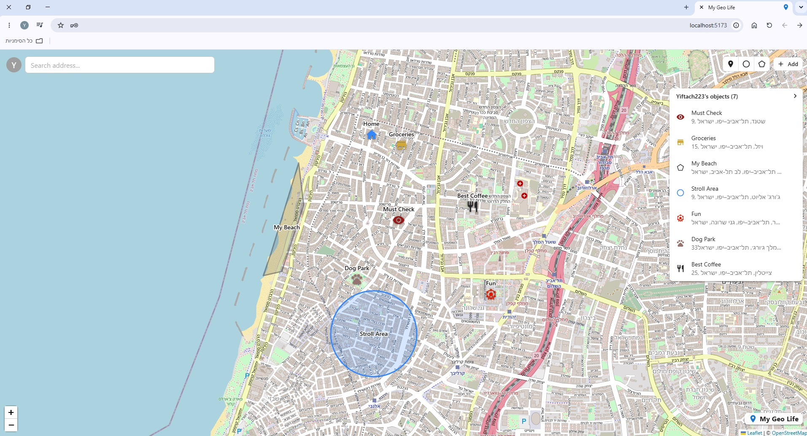
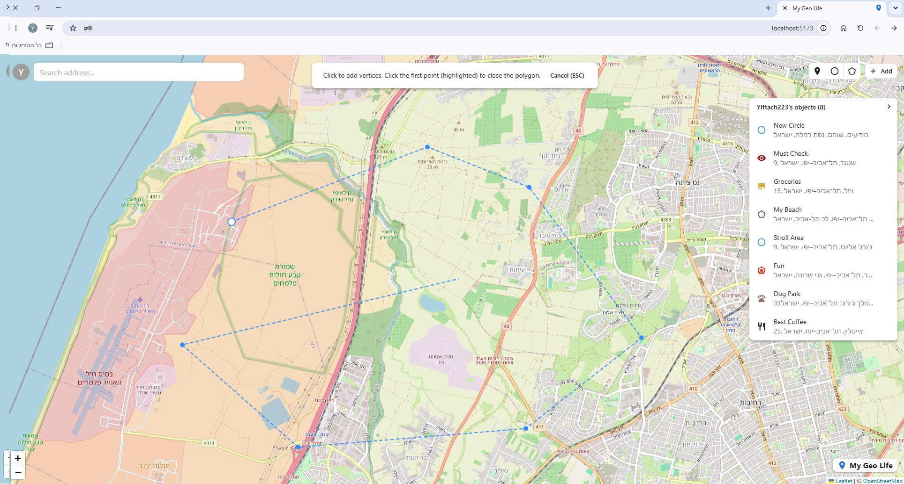
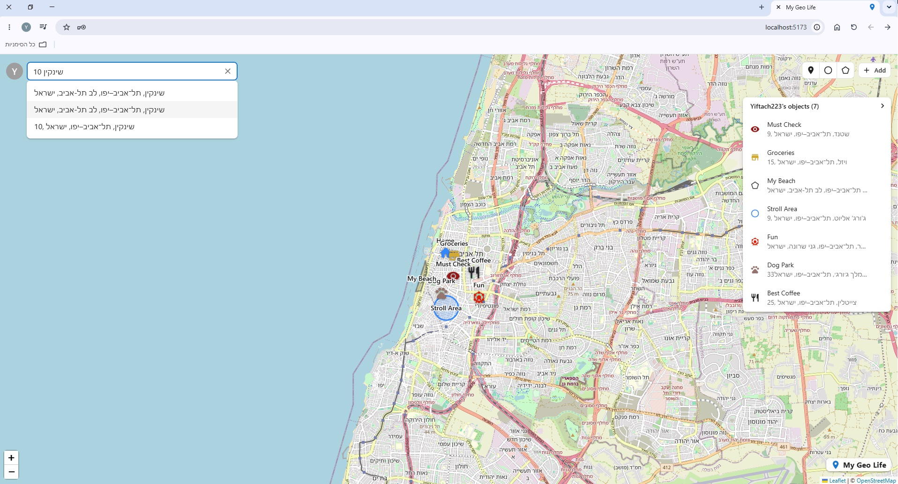
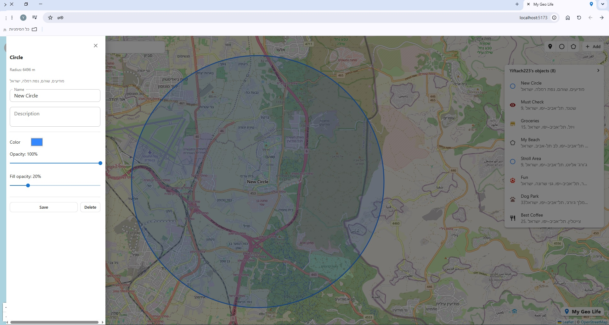
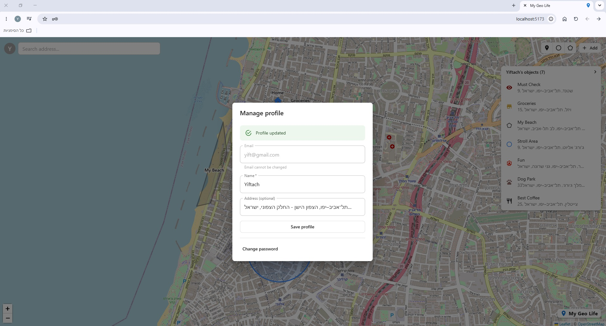

# My Geo Life

I built My Geo Life to keep a personal map of the places that matter to me: saved spots, areas I care about, and addresses I look up a lot. You search for a place, drop a pin or draw a shape around an area, and it's saved to your account for next time.

It's a full-stack project I wrote to get more comfortable with React, Leaflet and a Node/Express API, then deployed to AWS with CloudFormation.

[](https://github.com/Yiftach128/my-geo-life/actions/workflows/ci.yml)




## What it does

- Search any address and the map flies there and drops a labelled pin.
- Double-click anywhere to look up what's at that spot, then save it as a landmark in one click.
- Save three kinds of things on the map:
  - Landmarks: pins with a choice of 16 icons, in any color.
  - Circles: click a center and drag out the radius, with a live preview as you go.
  - Polygons: drop points one by one with a rubber-band line, then click back near the start to close the shape.
- Edit anything from a side panel: name, description, colors, opacity, or a landmark's icon.
- See everything you've saved in a list you can collapse, with jump-to, edit, and delete on each row.
- Map layer toggle: turn each type of object on and off.
- Sign up, log in, set a home address (it shows up as its own "Home" marker)

Every saved object also gets a readable address label, worked out from its coordinates.

## Demo

The looping clip above is a short highlight. For the whole thing:

Full walkthrough (about 2 minutes): [public/demo_final.mp4](public/demo_final.mp4)

<video src="public/demo_final.mp4" controls width="900"></video>

### Screenshots

| | |
| :---: | :---: |
|  |  |
| _Welcome screen_ | _Saved landmarks, circles and polygons_ |
|  |  |
| _Drawing a shape with a live preview_ | _Address search with autocomplete_ |
|  |  |
| _Editing an object's style_ | _Profile and password settings_ |

## Built with

Frontend: React and TypeScript, built with Vite. react-leaflet for the map, MUI , and TanStack React Query.

Backend: Node.js and Express in TypeScript, MongoDB (Atlas) with Mongoose, Zod for validation, and JWTs (jose) with bcrypt for auth.

Addresses are geocoded through OpenStreetMap's Nominatim service, called by the backend.

## How it's put together

The repo is two apps: an Express API in `backend/` and a React single-page app in `frontend/`, both TypeScript.

On the backend I kept each feature (auth, users, and the geo objects: landmarks, circles, polygons, geocoding) in its own module. Each module is split into the same layers: an HTTP controller, DTOs, a service that holds the actual logic, and a repository that talks to MongoDB behind an interface. It all gets wired together in one file, `backend/src/app.ts`.

The layering leans on a couple of SOLID ideas. Each layer has one job (single responsibility), and the service depends on a repository interface instead of the Mongoose code directly, so testing can be done with plain in-memory repository instead of a real DB. Requests and responses each have their own DTO, validated with Zod at the edge and kept separate from the domain objects, so the API's shape isn't tied to how data is stored.

Auth is stateless JWTs signed with jose, and passwords are hashed with bcrypt. Requests are guarded so you can only touch your own data.

The backend handles geocoding instead of the browser (using Nominatim api). It queues outgoing calls to stay under the limit and caches results. Creating or moving an object also reverse-geocodes its location to fill in that address label.

On the frontend, drawing a shape happens in steps: for a circle you click the center then move the mouse to set the radius; for a polygon each click creates a vertice and clicking the first one again closes it.

After you add, edit, or delete something, I update React Query's in-memory copy of the data directly, so the map changes quickly without a refetch from the server.
If the backend stops answering, the app confirms it by calling a `/health` endpoint, then shows a reconnecting popup.
```
Geo_app/
  backend/     Express + MongoDB API (TypeScript)
    src/
      app.ts       wires the modules together
      modules/     auth, user, geo (landmark, circle, polygon, geocode)
      shared/      config, security, middleware, errors
  frontend/    React + Leaflet SPA (Vite)
    src/
      components/  map, overlays, panels, auth, profile
      hooks/       React Query + logic
      services/    API clients
      types/       shared types and the drawing state machine
  public/      demo video, gif, screenshots
  Dockerfile   one production image: API + built frontend
  docker-compose.yml  runs that image with a local MongoDB
  cloudformation/  the AWS deployment as CloudFormation templates
  scripts/aws.sh  builds, pushes and deploys that image to AWS, or takes it down
  .github/workflows/  CI: tests, compiles, builds the image and lints the templates on every push
```

## Running it locally

You'll need Node.js 18+ and a MongoDB database (a free Atlas cluster works).

Start the backend first, since the frontend forwards its API calls to it.

Backend:

```bash
cd backend
npm install
cp .env.example .env    # then fill in MONGO_URI and JWT_SECRET
npm run dev             # runs on http://localhost:3000
```

Settings live in `.env` (there's a `backend/.env.example` to copy). Only `MONGO_URI` and `JWT_SECRET` are required; the rest have defaults:

- `MONGO_URI` (required): your MongoDB connection string
- `JWT_SECRET` (required): secret used to sign tokens
- `JWT_EXPIRES_IN`: how long a token stays valid, defaults to `7d`
- `PORT`: API port, defaults to `3000`
- `GEOCODER_BASE_URL`, `GEOCODER_USER_AGENT`, `GEOCODER_LANGUAGE`: geocoding options, default to Nominatim in Hebrew and English

Frontend:

```bash
cd frontend
npm install
npm run dev             # runs on http://localhost:5173
```

Then open http://localhost:5173.

A few other commands: on the backend, `npm run build` and `npm start` compile and run the API, and `npm test` runs the tests. On the frontend, `npm run build` type-checks and bundles for production.

## Running with Docker

The whole app ships as one image: Express serves the API and the built React app on port 3000. The compose file also starts a throwaway MongoDB, so this is the quickest way to run everything:

```bash
docker compose up --build    # then open http://localhost:3000
```

It reads `backend/.env` for `JWT_SECRET` and the optional geocoder settings, and points `MONGO_URI` at the bundled MongoDB container.

To build and run the image on its own, against any MongoDB:

```bash
docker build -t my-geo-life .
docker run --rm -p 3000:3000 -e MONGO_URI=... -e JWT_SECRET=... my-geo-life
```

The `Dockerfile` is multi-stage: the frontend and backend are built in separate stages, and only the compiled API, its production dependencies and the static frontend land in the final `node:24-alpine` image, which runs as the unprivileged `node` user.

## Deploying to AWS

The same image runs on AWS as an ECS Fargate service behind an application load balancer, with the infrastructure written as CloudFormation templates in `cloudformation/`:

```
browser --:80--> Application Load Balancer --:3000--> ECS Fargate tasks (1 to 3) --> MongoDB Atlas
                                                      image from ECR, secrets from SSM Parameter Store, logs to CloudWatch
```

Three stacks, split by lifecycle: `foundation` (ECR repository, log group, IAM roles) and `network` (VPC, public subnets, security groups) are deployed once and cost nothing. `app` (cluster, task definition, service, load balancer, auto scaling) is the only one that bills, a few cents an hour, so it goes up for a demo and comes down after:

```bash
scripts/aws.sh up v3      # build the image, push it to ECR, create or update the app stack, print the URL
scripts/aws.sh down       # delete the app stack and wait until it is gone
scripts/aws.sh status     # what is still there, and therefore still billing
```

How each stack is deployed and what it contains: [cloudformation/README.md](cloudformation/README.md).

## What I'd add next

- Add an option to share maps between users.

## About

Made by Yiftach Peleg.

- LinkedIn: https://www.linkedin.com/in/yiftach-peleg-4360762b4
- Email: yiftach2089@gmail.com
